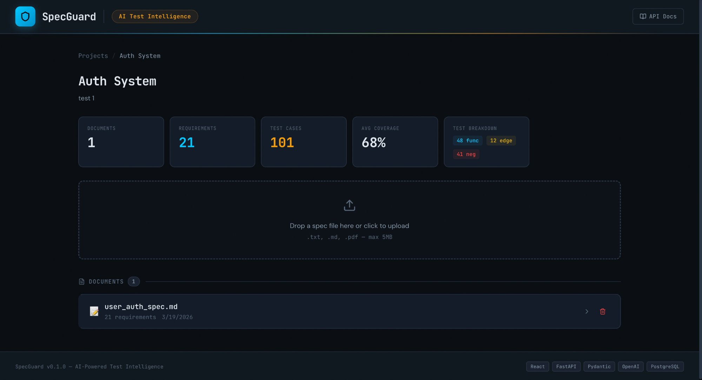
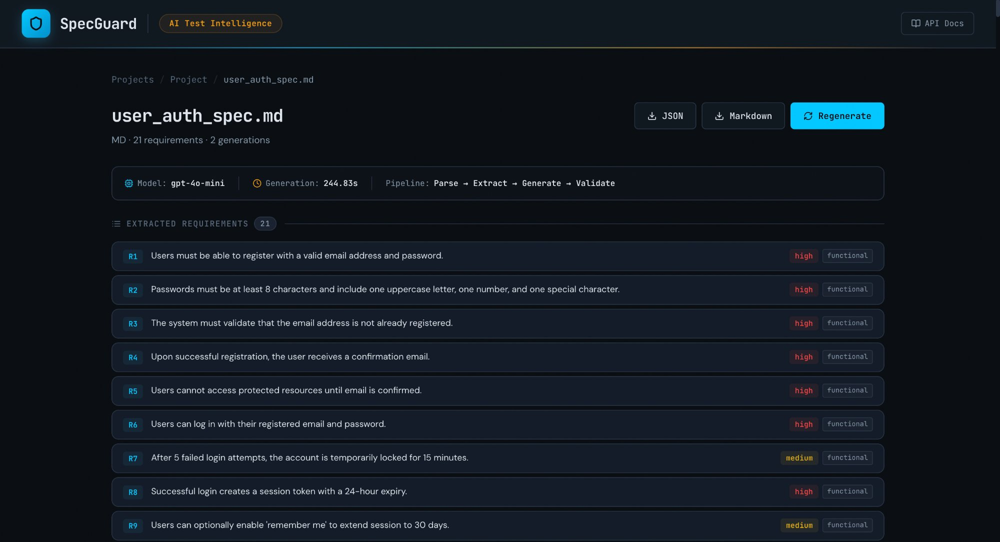
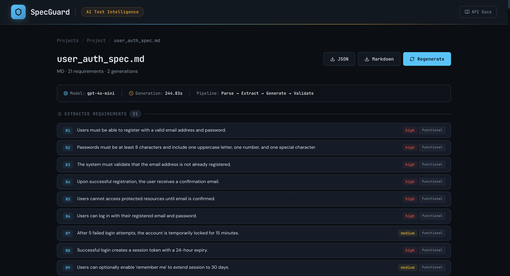

# SpecGuard: AI Test Intelligence Platform

An AI-powered engineering tool that ingests product specifications and generates **schema-validated test suites** with functional tests, edge cases, negative tests, and coverage analysis.

Built with a multi-stage processing pipeline: document parsing → requirement extraction → test generation → Pydantic validation → coverage scoring.





---

## How It Works

1. **Upload a spec** — feature specs, user stories, API docs, or release notes (`.txt`, `.md`, `.pdf`)
2. **Extract requirements** — AI parses the document into individual testable requirements, validated against a Pydantic schema
3. **Generate test cases** — for each requirement, generates functional tests, edge cases, and negative tests with automatic retry on validation failure
4. **Score and review** — coverage score computed across 4 heuristics; review, approve/reject, and export test cases as JSON or Markdown



## Architecture

```
React + TypeScript frontend
        │
        ▼  REST API
Python + FastAPI backend
   │         │
   │    AI Pipeline (4 stages)
   │    ├── Parse document
   │    ├── Extract requirements (OpenAI + Pydantic validation)
   │    ├── Generate tests per requirement (OpenAI + Pydantic validation)
   │    └── Score coverage (heuristic: req coverage, edge case ratio, negative ratio, step completeness)
   │
   └── SQLite (dev) / PostgreSQL (prod)
```

## Key Engineering Decisions

- **Multi-stage pipeline** over single-prompt generation — decomposing into parse → extract → generate → validate reduces hallucination and makes each stage independently debuggable
- **Pydantic schema validation on every AI output** with automatic retry and error feedback — the model self-corrects when outputs fail validation
- **Per-requirement generation** — smaller context per AI call produces more focused, less hallucinated test cases
- **Coverage scoring** as a heuristic quality metric — measures requirement coverage, edge case density, negative test ratio, and step completeness
- **Python + FastAPI** chosen deliberately over Node.js to demonstrate stack versatility and leverage Pydantic's native integration

## Tech Stack

| Layer | Technology |
|-------|-----------|
| Frontend | React, TypeScript, Vite, Lucide Icons |
| Backend | Python, FastAPI, Pydantic v2, SQLAlchemy 2.0 |
| Database | SQLite (dev) / PostgreSQL (prod) |
| AI | OpenAI gpt-4o-mini with JSON mode + structured output validation |
| Testing | pytest |

## Quick Start

### Prerequisites

- Python 3.10+
- Node.js 18+
- OpenAI API key

### Backend

```bash
cd backend
python3 -m venv .venv
source .venv/bin/activate
pip install -r requirements.txt

cp ../.env.example .env
# Add your OPENAI_API_KEY to .env

uvicorn app.main:app --reload
```

API available at `http://localhost:8000` with Swagger docs at `/docs`.

### Frontend

```bash
cd frontend
npm install
npm run dev
```

Frontend available at `http://localhost:5173`.

### Run Tests

```bash
cd backend
python -m pytest tests/ -v
```

## Project Structure

```
specguard/
├── backend/
│   ├── app/
│   │   ├── main.py              # FastAPI application
│   │   ├── config.py            # Environment settings (Pydantic Settings)
│   │   ├── database.py          # Async SQLAlchemy setup
│   │   ├── models/              # SQLAlchemy ORM models
│   │   ├── schemas/             # Pydantic schemas
│   │   │   ├── api.py           # Request/response schemas
│   │   │   └── ai_output.py     # AI output validation schemas
│   │   ├── routes/              # API endpoints (projects, documents, generation, test suites)
│   │   ├── services/
│   │   │   ├── ai_client.py     # OpenAI wrapper with retry logic
│   │   │   ├── pipeline.py      # Multi-stage pipeline orchestrator
│   │   │   ├── file_parser.py   # Document ingestion (.txt, .md, .pdf)
│   │   │   └── scorer.py        # Coverage scoring algorithm
│   │   └── prompts/             # AI prompt templates
│   └── tests/                   # pytest suite
├── frontend/
│   └── src/
│       ├── api/client.ts        # Typed API client
│       ├── types/index.ts       # TypeScript type definitions
│       ├── components/          # ScoreRing, TestCaseCard, CreateProjectModal
│       └── pages/               # ProjectsPage, ProjectPage, DocumentPage
└── sample_docs/                 # Example specs for testing
```

## License

MIT
