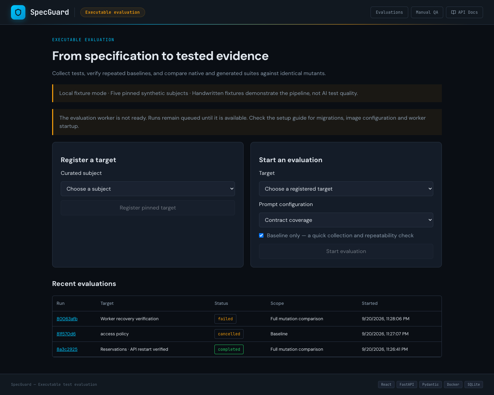
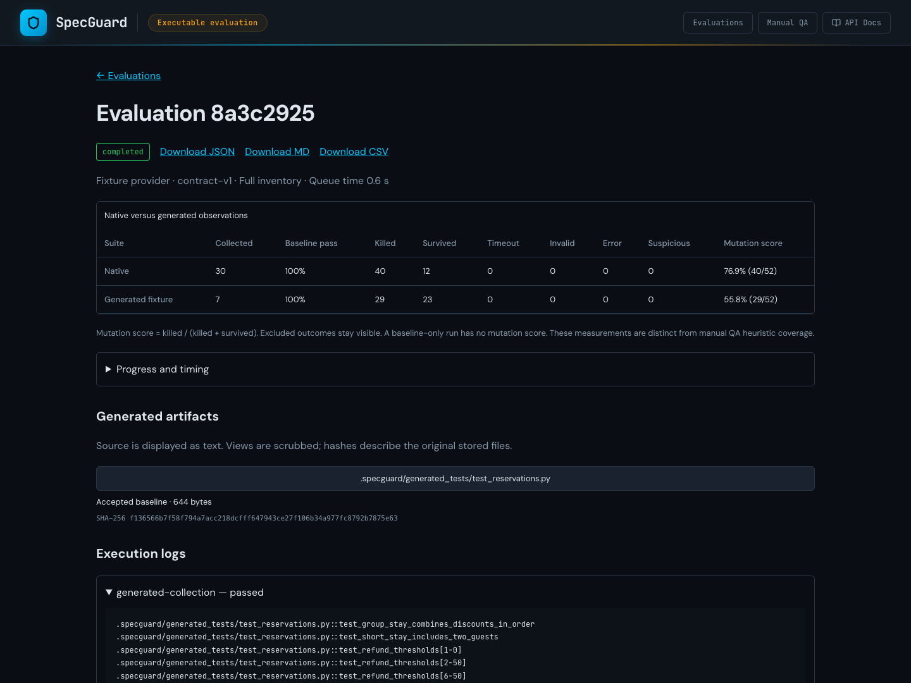
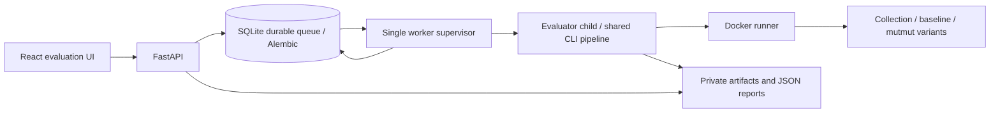

# SpecGuard

Executable test evaluation from specifications: validate pytest artifacts, require repeated passing baselines, then compare native and generated suites against the **same pinned mutation inventory**.

The local web product uses five curated subjects and handwritten fixtures. The CLI also has a live-generation adapter, but all published verification is offline; fixture results do not establish AI test quality.

## Measured benchmark

Twenty evaluations completed across five pinned synthetic subjects (two prompt configurations × two trials). Tests are handwritten fixtures, not live-model output; these results do not measure prompt quality.

| Subject | Native killed / denominator | Fixture killed / denominator | Completed trials |
| --- | --- | --- | --- |
| access_policy | 7/7 (100.0%) | 6/7 (85.7%) | 4/4 |
| first_subject | 40/52 (76.9%) | 29/52 (55.8%) | 4/4 |
| intervals | 4/6 (66.7%) | 3/6 (50.0%) | 4/4 |
| pagination | 12/13 (92.3%) | 8/13 (61.5%) | 4/4 |
| shipping | 12/13 (92.3%) | 3/13 (23.1%) | 4/4 |

Three sequential cache trials averaged 77.1 s cold and 43.2 s warm on the first subject. See [measurements, limitations and reproduction](docs/phase-5-validation.md).

## Try it locally

Install Docker Desktop (or a local Linux Docker engine with cgroups v2 and default seccomp), Git, and Docker Compose. From this repository's root:

```bash
docker build --tag specguard-runner:evaluation docker/runner
export EVALUATION_RUNNER_IMAGE="$(docker image inspect specguard-runner:evaluation --format '{{.Id}}')"
export SPECGUARD_WORKSPACE="$PWD"
mkdir -p .specguard-data/tmp benchmark-runs
docker compose up --build -d
```

Open **http://localhost:8080**. Register `access_policy`, leave **Baseline only** selected, and start an evaluation. Uncheck it for the mutation comparison. No API key is required. Dependencies are downloaded during image builds; evaluation itself uses local fixtures and has no network access inside runner containers.

API documentation: http://localhost:8000/docs. `GET /api/health` checks the API; `GET /api/evaluations/ready` checks the migrated database, worker heartbeat, and image configuration. Stop with `docker compose down`; persisted data stays on disk. The [operations guide](docs/evaluation-operations.md) covers development servers, port overrides, recovery, backup and retention.




## Architecture


```mermaid
flowchart LR
    UI[React evaluation UI] --> API[FastAPI]
    API --> DB[(SQLite durable queue / Alembic)]
    DB --> W[Single worker supervisor]
    W --> E[Evaluator child / shared CLI pipeline]
    E --> D[Docker runner]
    D --> T[Collection / baseline / mutmut variants]
    E --> A[Private artifacts and JSON reports]
    W --> DB
    API --> A
```

The API persists requests and never owns long-running evaluation tasks. A separate worker claims one run, supervises a bounded child process, and records progress and terminal results. API restarts preserve work. Worker loss produces a retained failed record after recovery; it does not silently retry execution. Repeated submissions with the same idempotency key return the same run.

Artifacts, execution logs, native/generated results, filtered mutants and JSON/Markdown/CSV downloads are available in the UI. Scores show `killed / (killed + survived)`; timeouts, invalid mutants, errors and suspicious outcomes remain separate. Baseline-only and incomplete runs do not imply a successful mutation evaluation.

## Isolation and scope

Test code runs in fresh non-root containers with networking disabled, read-only staged inputs/root filesystem, dropped capabilities, default seccomp, bounded temporary storage, memory, processes, output and wall time. Only the trusted worker has the Docker socket. The API accepts installed curated subjects; it cannot accept arbitrary repositories, commands, images or live providers.

This is a **local/private, single-host** application without authentication. Container isolation is not a proof against hostile Python, Docker/kernel exploits or falsified test observations. Do not expose it as a public multi-tenant execution service. See the [threat model](docs/threat-model.md).

## Two-minute demo

1. Open the evaluator and register `access_policy` (about 15 seconds).
2. Start a baseline check and watch queued → preparing → collection → baseline → completed. Inspect generated source and execution logs (about 30 seconds, hardware dependent).
3. Start a full comparison. Inspect the distinct native and fixture results, select surviving mutants, expand a diff, and download JSON or CSV (about 60 seconds).
4. Start another run and cancel it. Show its retained cancelled state, then open **Manual QA** to see the separate legacy workflow (about 15 seconds).

Full evaluation timing depends on Docker and host load; a completed local run can be used for the comparison portion.

## Reproduce and verify

The [CLI guide](docs/evaluation-cli.md) documents single evaluations, the five-subject matrix and fixture/live distinctions. [Methodology](docs/evaluation-methodology.md) defines eligibility and denominators. [Phase 5 evidence](docs/phase-5-validation.md) contains repeated measurements; [Phase 6 validation](docs/phase-6-validation.md) records lifecycle, Compose and browser checks.

For Python 3.12 development:

```bash
cd backend
python3.12 -m venv .venv
.venv/bin/python -m pip install -r requirements.txt
.venv/bin/python -m pytest -q
# Docker opt-in checks (export the immutable runner ID first):
SPECGUARD_DOCKER_TESTS=1 SPECGUARD_RUNNER_IMAGE="$EVALUATION_RUNNER_IMAGE" \
  .venv/bin/python -m pytest tests/evaluation/test_execution_docker.py \
  tests/evaluation/test_evaluation_docker.py tests/evaluation/test_product_docker.py -q
```

For Node.js 22 development, run `npm ci` and `npm run build` from `frontend/`. CI runs backend tests, the frontend build and a separate Docker verification job. Deterministic tests require no API credits. Backend direct dependencies are pinned; transitive application dependencies are not fully locked. The runner uses hashed dependency locks and an immutable image ID.

## Legacy manual QA

`/projects` retains document upload, requirement extraction, manual test descriptions, review and JSON/Markdown exports. Live manual generation needs an OpenAI API key; the default Compose stack deliberately sets an empty key. Its heuristic coverage is distinct from executable mutation score. Its tasks still run in the API process and its development database still uses startup `create_all`; the durable worker and Alembic migration described here apply to evaluation only.

## Repository map

- `backend/app/evaluation/`: preparation, generation, baseline/mutation evaluation, durable store and worker.
- `backend/app/routes/evaluations.py`: curated evaluation API.
- `backend/evaluation_migrations/`: explicit evaluation schema migrations.
- `frontend/src/pages/EvaluationsPage.tsx`: evaluation UI.
- `benchmarks/subjects/`: five pinned first-party synthetic subjects and fixtures.
- `benchmarks/results/phase5-offline/`: small checked-in measurement summaries.
- `docker/`, `compose.yaml`: runner and local application stack.
- `docs/`: contracts, methodology, operations and validation evidence.

MIT — see [LICENSE](LICENSE).
