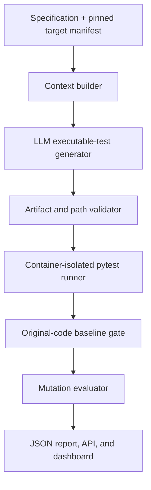

# SpecGuard v2 Implementation Plan

## Purpose

This document is a self-contained implementation brief for upgrading SpecGuard from a structured manual test-case generator into a credible test-generation and evaluation platform.

Repository: <https://github.com/dazainer/specguard>

Portfolio: <https://www.zainkhalil.ca/portfolio>

The intended end state is:

> SpecGuard converts product specifications into executable pytest suites, verifies those suites against the original implementation, and objectively evaluates their defect-detection ability through mutation testing.

The work should be incremental. Preserve the existing manual QA workflow, deliver one complete vertical slice before broadening scope, and do not execute model-generated code directly on the host.

---

## Instructions for Codex

1. Work from the existing public repository. Read any repository-level `AGENTS.md` before acting.
2. Inspect `git status` before every implementation phase and preserve unrelated user changes.
3. Do not push, deploy, modify the public portfolio, or change the resume unless explicitly authorized.
4. Do not implement all phases in one large change. Complete and verify each phase before continuing.
5. Prefer small, reviewable modules and cohesive commits. If committing is not authorized, propose a commit message for each completed unit.
6. Use deterministic fakes for automated tests. Live model calls must never be required for CI.
7. Never execute LLM-generated code directly on the host machine.
8. Never mount secrets, the Docker socket, the repository's `.git` directory, or broad host directories into the execution environment.
9. Do not describe ordinary Docker execution as a fully secure sandbox. Use the term **container-isolated execution** unless stronger isolation is actually implemented and validated.
10. After every phase, report:
    - files changed;
    - architectural decisions;
    - commands run and their results;
    - remaining risks or deferred work;
    - the recommended next phase.

---

## Current Baseline

The following findings were confirmed against the public repository before this plan was written.

### What already works

- The React interface is visually polished and presents a coherent product.
- The FastAPI application starts successfully.
- Basic project and document API routes work against an isolated SQLite database.
- All 23 existing backend tests pass.
- The backend is divided into routes, schemas, services, models, and prompts.
- AI responses are validated using Pydantic.
- Test suites can be reviewed, approved/rejected, and exported as JSON or Markdown.
- The current portfolio description is broadly accurate.

### Confirmed problems

- `npm run build` fails because of two unused imports:
  - `Github` in `frontend/src/App.tsx`;
  - `BarChart3` in `frontend/src/pages/ProjectPage.tsx`.
- The 23 tests cover schemas and the heuristic scorer, not the complete system.
- There are no automated tests for routes, persistence, file parsing, exports, AI retries, background generation, or the frontend.
- The current score measures generated structure, not real defect detection.
- The prompt asks for the same edge-case, negative-test, and step properties that the scorer rewards, making the score partly self-graded.
- Generated outputs are manual test descriptions, not executable tests.
- `asyncio.create_task` is used for background generation, so work is lost if the API process restarts.
- Validation statistics are stored in process memory and are neither durable nor reliable across workers.
- Invalid JSON and empty model responses do not follow the same retry path as Pydantic validation failures.
- The README contains a broken screenshot reference.
- The README claims an MIT license, but the repository has no `LICENSE` file.
- There is no CI workflow, container configuration, or working Alembic migration setup.
- Some declared dependencies appear unused.
- The API Docs link in the frontend is hard-coded to localhost.
- Almost the entire application entered the repository in one initial commit, followed mainly by screenshot/README commits. Future development should demonstrate incremental engineering history.

---

## Product Thesis

SpecGuard v2 should support two related modes.

### Mode A: Manual QA generation

Preserve the existing behavior:

- ingest text, Markdown, and PDF specifications;
- extract requirements;
- generate structured functional, negative, and edge-case test descriptions;
- allow review and export.

### Mode B: Executable evaluation

Add a new, deliberately scoped workflow:

1. Accept a product specification and a pinned Python repository target.
2. Select the public interface and source context required for the task.
3. Generate one or more executable pytest files.
4. Validate artifact paths and structure.
5. Collect and execute the tests in an isolated environment.
6. Reject generated tests that do not pass on the original implementation.
7. Run mutation analysis against the accepted suite.
8. Compare generated tests with the repository's native tests using the same target code and mutation configuration.
9. Produce a reproducible report containing quality, reliability, cost, and runtime metrics.

---

## Scope and Non-Goals

### Initial supported scope

- Python only.
- pytest only.
- Small, curated repositories with pinned commit SHAs.
- Explicit configuration through a checked-in manifest.
- CLI/benchmark-first operation.
- Local or private evaluation runs before any public arbitrary-code service.

### Explicit non-goals for the first release

- Multiple programming languages.
- Automatically supporting arbitrary GitHub repositories.
- A public multi-tenant arbitrary-code execution service.
- Reimplementing mutation operators.
- Building a custom scheduler or worker pool before profiling proves it necessary.
- Kubernetes.
- Model fine-tuning.
- Treating mutation score as an absolute measure of correctness.
- Replacing the existing manual-test workflow.
- Starting a separate new portfolio project before SpecGuard reaches its benchmark milestone.

---

## Target Architecture



### Suggested new structure

Do not perform a broad rewrite merely to match this tree. Introduce these modules as the vertical slice requires them.

```text
specguard/
├── backend/
│   ├── app/
│   │   ├── evaluation/
│   │   │   ├── manifest.py
│   │   │   ├── context_builder.py
│   │   │   ├── generator.py
│   │   │   ├── artifact_validator.py
│   │   │   ├── execution_runner.py
│   │   │   ├── mutation_runner.py
│   │   │   ├── metrics.py
│   │   │   └── report.py
│   │   ├── schemas/
│   │   │   └── evaluation.py
│   │   └── routes/
│   │       └── evaluations.py
│   └── tests/
│       ├── evaluation/
│       ├── integration/
│       └── fixtures/
├── benchmarks/
│   ├── subjects/
│   │   └── first_subject/
│   │       ├── spec.md
│   │       ├── specguard.yaml
│   │       └── README.md
│   └── results/
├── docker/
│   └── runner/
│       ├── Dockerfile
│       └── seccomp-profile.json
├── docs/
│   ├── v2-design.md
│   ├── threat-model.md
│   ├── evaluation-methodology.md
│   └── benchmark-results.md
└── .github/workflows/
    └── ci.yml
```

### Proposed target manifest

Start with an explicit configuration rather than unreliable repository autodetection.

```yaml
schema_version: 1
language: python

repository:
  url: https://github.com/example/project.git
  commit: full-commit-sha

specification:
  path: spec.md

environment:
  python_version: "3.12"
  install_command: "uv sync --frozen"

tests:
  native_paths:
    - tests/
  generated_path: .specguard/generated_tests/
  baseline_command: "pytest -q"

mutation:
  source_paths:
    - src/
  timeout_seconds: 120

limits:
  memory_mb: 1024
  cpus: 1.0
  pids: 128
  output_kb: 1024
```

All manifest-controlled commands are trusted configuration for curated benchmark subjects. Do not accept arbitrary user-supplied shell commands in a public API.

---

## Evaluation Methodology

### Required gates

A generated suite is eligible for mutation evaluation only if it:

1. uses allowed paths;
2. contains only expected artifact types;
3. can be collected by pytest;
4. completes within the configured timeout;
5. passes against the original implementation;
6. produces stable results across the configured repeat count.

### Required separation

- Native tests and generated tests must be run independently.
- Generated-test evaluation must not silently include native tests.
- Native and generated suites must evaluate the same pinned source revision.
- Native and generated comparisons must use the same mutation configuration and mutant set.
- The model must not receive native test files unless an experiment explicitly studies test-aware generation and labels it accordingly.
- Prompt version, model identifier, temperature, seed when supported, repository commit, dependencies, and runner image digest must be recorded.

### Core metrics

Every evaluation report should include:

- generation success rate;
- pytest collection success rate;
- baseline pass rate on original code;
- number of accepted and rejected generated tests;
- mutants generated;
- mutants killed;
- mutants survived;
- mutants timed out;
- invalid/error/suspicious mutants;
- primary mutation score with its denominator clearly defined;
- native-suite mutation score;
- generated-suite mutation score;
- generation duration;
- execution duration;
- mutation duration;
- token usage and estimated model cost when available;
- repeat-to-repeat variance;
- tool and dependency versions.

Recommended primary score:

```text
mutation_score = killed / (killed + survived)
```

Report timeouts, invalid mutants, and errors separately rather than quietly counting them as kills. Equivalent mutants cannot always be identified automatically, so the report must not claim that mutation score is an infallible measure of correctness.

---

# Implementation Phases

## Phase 0 — Stabilize the Existing Repository

### Goal

Establish a reproducible, green baseline before adding v2 behavior.

### Tasks

- [ ] Fix the two unused TypeScript imports currently breaking the production build.
- [ ] Add an actual MIT `LICENSE` file or remove the README claim if a different license is intended.
- [ ] Fix the broken README screenshot path.
- [ ] Make the API documentation URL configurable or relative.
- [ ] Add GitHub Actions CI for:
  - backend dependency installation;
  - backend pytest;
  - frontend `npm ci`;
  - frontend production build.
- [ ] Add explicit pytest configuration and resolve current collection/deprecation warnings.
- [ ] Add tests for:
  - text/Markdown parsing;
  - PDF parsing success and failure;
  - project/document CRUD routes;
  - export routes;
  - AI schema-validation retry behavior;
  - invalid JSON behavior;
  - empty model responses;
  - partial per-requirement generation failure;
  - pipeline status transitions.
- [ ] Use a fake AI client in tests; CI must not require an API key.
- [ ] Review and remove or justify unused dependencies such as tooling imported nowhere in the current implementation.
- [ ] Decide whether to retain `requirements.txt` or move to `pyproject.toml` plus a lockfile. Do not let packaging migration block the vertical slice.
- [ ] Update Quick Start instructions and verify them from a fresh environment.

### Acceptance criteria

- [ ] `python -m pytest` passes without unexpected warnings.
- [ ] `npm run build` passes.
- [ ] CI passes from a clean checkout.
- [ ] No live AI calls occur in automated tests.
- [ ] README setup instructions are reproducible.
- [ ] `git status` is clean after verification commands.

### Suggested commit sequence

1. `fix: restore frontend production build`
2. `test: add API and pipeline regression coverage`
3. `ci: validate backend tests and frontend build`
4. `docs: repair setup, screenshots, and licensing`

---

## Phase 1 — Define the v2 Contract and Benchmark Fixture

### Goal

Specify exactly what is being generated, executed, compared, and measured before wiring a live model into code execution.

### Tasks

- [ ] Create `docs/v2-design.md`.
- [ ] Create `docs/evaluation-methodology.md`.
- [ ] Define the versioned manifest schema.
- [ ] Implement a strict Pydantic manifest model.
- [ ] Validate repository URLs, commit SHAs, paths, commands, limits, and schema versions.
- [ ] Reject absolute paths, `..` traversal, symlink escapes, and generated files outside the allowed directory.
- [ ] Define the executable generation schema, for example:

```python
class GeneratedTestFile(BaseModel):
    path: str
    content: str


class ExecutableTestGenerationResult(BaseModel):
    files: list[GeneratedTestFile]
    assumptions: list[str] = []
    targeted_requirements: list[str] = []
```

- [ ] Record prompt version and generation configuration in every run.
- [ ] Create one small, deterministic benchmark subject with:
  - a specification;
  - a pinned implementation;
  - a native pytest suite;
  - clearly documented public interfaces;
  - several known behaviors suitable for mutation.
- [ ] Initially use a deterministic fixture containing known-safe generated test content to exercise the orchestration contract.
- [ ] Decide which source files are visible to the model. For v1, prefer manifest-declared modules over embeddings or automatic whole-repository retrieval.

### Required design decision

Document whether the first benchmark is:

- **spec-only/black-box**, where the model sees the specification and a public interface description; or
- **spec-plus-code/white-box**, where the model also sees selected implementation files.

Do not mix these modes in one benchmark result. A useful later experiment is to compare them.

### Acceptance criteria

- [ ] Manifest parsing and validation have complete tests.
- [ ] Unsafe paths and unsupported schema versions are rejected.
- [ ] One benchmark subject can be prepared reproducibly without network-dependent floating versions.
- [ ] The evaluation report schema is defined before mutation integration.
- [ ] No arbitrary generated code has been executed on the host.

---

## Phase 2 — Build the Container-Isolated Execution Runner

### Goal

Create the execution boundary before connecting live LLM output.

### Threat model first

Create `docs/threat-model.md` before implementing the runner.

#### Assets to protect

- host filesystem;
- user files and credentials;
- environment variables and API keys;
- Docker socket and daemon;
- host network and internal services;
- CPU, memory, disk, PIDs, and log storage;
- other evaluation jobs.

#### Expected attacks and failures

- infinite loops;
- fork/process bombs;
- excessive allocation;
- output flooding;
- writes outside the scratch directory;
- symlink/path traversal;
- reading environment secrets;
- outbound HTTP/DNS attempts;
- subprocess execution;
- access to `/proc`, devices, or the Docker socket;
- tests that hang during collection;
- tests that intentionally crash the interpreter.

### Minimum controls

- [ ] Run as a non-root user.
- [ ] Use a minimal, pinned runner image.
- [ ] Disable network access.
- [ ] Use a read-only root filesystem.
- [ ] Provide only a bounded writable scratch location.
- [ ] Drop all Linux capabilities.
- [ ] Enable `no-new-privileges`.
- [ ] Retain Docker's default seccomp protection or supply a stricter tested profile.
- [ ] Set explicit CPU, memory, PID, file-size, and wall-clock limits.
- [ ] Cap stdout/stderr size.
- [ ] Never pass host secrets into the container.
- [ ] Never mount the Docker socket.
- [ ] Mount only the prepared target snapshot and generated-test workspace.
- [ ] Destroy the execution workspace after retaining sanitized artifacts.
- [ ] Return structured results for success, test failure, collection failure, timeout, resource exhaustion, and infrastructure error.

### Runner interface

The backend should call a typed interface rather than assembling Docker commands throughout the application.

```python
class ExecutionRequest(BaseModel):
    target_snapshot: Path
    test_paths: list[str]
    command: list[str]
    timeout_seconds: int
    limits: ResourceLimits


class ExecutionResult(BaseModel):
    status: Literal[
        "passed",
        "failed",
        "collection_error",
        "timeout",
        "resource_limit",
        "infrastructure_error",
    ]
    exit_code: int | None
    duration_seconds: float
    stdout: str
    stderr: str
```

Avoid `shell=True`. Commands should be represented as argument arrays whenever possible.

### Adversarial verification fixtures

- [ ] Infinite loop terminates at the timeout.
- [ ] High memory allocation is stopped by the memory limit.
- [ ] Process bomb is stopped by the PID limit.
- [ ] Outbound network request fails.
- [ ] Write outside the allowed scratch area fails.
- [ ] Environment inspection reveals no secrets.
- [ ] Output flooding is truncated safely.
- [ ] A normal pytest suite still runs successfully.

### Acceptance criteria

- [ ] All adversarial fixtures behave as expected.
- [ ] The normal fixture runs successfully.
- [ ] Structured results distinguish test failures from runner failures.
- [ ] No generated test code is executed directly on the host.
- [ ] Documentation calls this container-isolated execution, not a perfect security boundary.

Do not expose arbitrary repository execution publicly after this phase. A public multi-tenant service would require a separate security review and likely a stronger runtime such as gVisor or a microVM boundary.

---

## Phase 3 — Generate and Gate Executable pytest Suites

### Goal

Complete one end-to-end specification-to-executable-tests vertical slice.

### Tasks

- [ ] Preserve the existing manual test-generation endpoint and schemas.
- [ ] Add a separate executable-generation prompt and output schema.
- [ ] Introduce a provider interface around the current AI client so tests can use a deterministic fake.
- [ ] Retry malformed JSON, empty responses, schema failures, and retryable provider errors according to an explicit policy.
- [ ] Record all attempts and final validation results without logging secrets or full sensitive inputs.
- [ ] Generate only files beneath the configured generated-test directory.
- [ ] Enforce file-count and total-size limits.
- [ ] Normalize line endings and compute content hashes for generated artifacts.
- [ ] Execute `pytest --collect-only` inside the runner.
- [ ] Execute accepted tests against the original implementation.
- [ ] Reject or quarantine any test that fails the original-code baseline.
- [ ] Repeat the baseline when configured to detect obvious flakiness.
- [ ] Save artifacts and structured results to a run directory first. Do not finalize database tables until the JSON contract is stable.
- [ ] Provide a CLI command for the vertical slice, for example:

```bash
specguard evaluate benchmarks/subjects/first_subject/specguard.yaml
```

### Context strategy for the first version

Use manifest-declared files and public interfaces. Do not add RAG, repository embeddings, call-graph extraction, or automated dependency graphing until the basic evaluator works and a measured context problem exists.

### Acceptance criteria

- [ ] One command executes the complete first benchmark.
- [ ] A fake provider drives the same pipeline in CI.
- [ ] A live provider can generate a pytest artifact outside CI.
- [ ] The test is collected and passes against the original implementation inside the runner.
- [ ] Invalid, failing, timing-out, or flaky outputs are reported honestly.
- [ ] The generated file, prompt version, model configuration, logs, timings, and result JSON are retained.

### Suggested commit sequence

1. `feat: define executable test generation schema`
2. `feat: add provider-independent generation service`
3. `feat: run generated pytest artifacts through baseline gate`
4. `test: cover executable generation failure modes`

---

## Phase 4 — Add Mutation-Based Quality Evaluation

### Goal

Replace self-graded quality claims with externally exercised defect-detection evidence.

### Tooling decision

Integrate an existing engine, initially `mutmut`. Do not implement mutation operators.

`mutmut` already supports relevant-test selection, parallel execution, incremental results, timeouts, and optional coverage-based filtering. Wrap it as an evaluation dependency and normalize its results into SpecGuard's report schema.

### Tasks

- [ ] Pin and document the mutation engine version.
- [ ] Define source paths and excluded paths in the manifest.
- [ ] Produce one deterministic mutant inventory for each evaluation target.
- [ ] Run the native suite and generated suite against equivalent mutant inventories.
- [ ] Ensure generated-suite runs do not load native tests.
- [ ] Parse and normalize killed, survived, timeout, suspicious, invalid, and error outcomes.
- [ ] Store per-mutant metadata:
  - stable ID;
  - operator;
  - source file and line;
  - textual change or diff;
  - status;
  - duration;
  - killing test when available.
- [ ] Calculate and display mutation score with a visible denominator.
- [ ] Preserve raw engine output as an artifact for debugging.
- [ ] Add a manual-review field for equivalent or questionable mutants.
- [ ] Test parsing against fixed engine-output fixtures.

### Required comparison table

```text
Suite          Collected  Baseline pass  Killed  Survived  Timeout  Invalid  Score
Native         ...        ...            ...     ...       ...      ...      ...
Generated      ...        ...            ...     ...       ...      ...      ...
```

### Acceptance criteria

- [ ] The first benchmark produces a reproducible native-versus-generated report.
- [ ] Both suites operate on the same pinned source revision and equivalent mutant inventory.
- [ ] The score cannot be inflated by tests that fail on the original implementation.
- [ ] Timeouts and invalid mutants are visible rather than silently counted as kills.
- [ ] Raw artifacts are available for investigation.

---

## Phase 5 — Build the Benchmark and Optimize Measured Bottlenecks

### Goal

Generate defensible evidence across multiple projects without prematurely building generalized infrastructure.

### Benchmark expansion

- [ ] Expand from one subject to approximately 5–10 pinned Python repositories or benchmark subjects.
- [ ] Select small projects with:
  - clear specifications or public API contracts;
  - reproducible dependencies;
  - manageable native test runtime;
  - code suitable for mutation;
  - licenses permitting benchmark use.
- [ ] Document why each subject was included.
- [ ] Preserve commit SHAs and dependency locks.
- [ ] Store benchmark specifications in the repository when licensing permits, otherwise document their source.
- [ ] Run multiple trials where model nondeterminism matters.
- [ ] Compare at least two prompt strategies or generation-context strategies.
- [ ] Optionally compare models only after the methodology is stable.

### Performance work

Profile before optimizing. Candidate improvements include:

- mutation-engine caching;
- coverage-guided mutant filtering;
- relevant-test selection;
- early termination after the first killing test;
- bounded parallel subject execution;
- mutant sampling for quick preview runs;
- full runs reserved for final benchmark reporting.

Do not build a custom worker pool merely to claim concurrency. The mutation engine already parallelizes important work. Add orchestration concurrency only if measured traces show repository-level scheduling is the bottleneck.

### Required benchmark outputs

- machine-readable JSON;
- human-readable Markdown summary;
- CSV suitable for plotting;
- environment and version manifest;
- failure taxonomy;
- benchmark table in the README;
- raw per-run artifacts excluded from Git when excessively large, with documented reproduction commands.

### Acceptance criteria

- [ ] The benchmark runs from a documented command.
- [ ] At least 5 subjects complete successfully before resume claims use an `N repositories` metric.
- [ ] Results contain repeated-run variance where relevant.
- [ ] Native and generated suites are compared fairly.
- [ ] Before/after optimization timing is recorded.
- [ ] Any performance claim has raw supporting measurements.

---

## Phase 6 — Productize the Evaluator

### Goal

Integrate the proven CLI/benchmark pipeline into the FastAPI product without weakening reproducibility or isolation.

### Data model

Add persistence only after the filesystem/JSON report contract is stable. Likely entities include:

- `EvaluationTarget`
  - repository URL;
  - commit SHA;
  - manifest version;
  - source/native/generated paths.
- `EvaluationRun`
  - status;
  - prompt/model configuration;
  - timestamps and durations;
  - environment digest;
  - summary metrics;
  - failure reason.
- `GeneratedArtifact`
  - relative path;
  - content hash;
  - collection status;
  - baseline status.
- `MutationOutcome`
  - mutant identity;
  - operator/location;
  - result category;
  - duration;
  - related artifact/test.

Use Alembic properly once schema migration begins. Do not use `create_all` as the production migration strategy.

### Background execution

Long evaluation runs should not use bare `asyncio.create_task` in the web process.

- [ ] Introduce a durable worker boundary when evaluation enters the web application.
- [ ] Choose a lightweight queue only after the job contract is stable.
- [ ] Persist queued, preparing, generating, collecting, baseline-running, mutating, completed, cancelled, and failed states.
- [ ] Make retries idempotent.
- [ ] Ensure an API restart does not lose a running evaluation record.
- [ ] Add cancellation and hard runtime ceilings.

Avoid unnecessary distributed-system complexity. A single worker with durable state is sufficient initially.

### API and UI integration

- [ ] Create/list/get evaluation targets.
- [ ] Start an evaluation run.
- [ ] Poll or stream run state.
- [ ] View generated artifacts.
- [ ] View execution logs with truncation and secret scrubbing.
- [ ] View native-versus-generated metrics.
- [ ] Browse surviving and killed mutants.
- [ ] Download JSON/Markdown/CSV reports.
- [ ] Keep the CLI as the reproducible reference path.

### Observability and operations

- [ ] Structured logs with run IDs and stage names.
- [ ] Health and readiness checks for API and worker.
- [ ] Metrics for queue time, stage duration, failures, timeouts, and resource-limit events.
- [ ] Bounded artifact retention.
- [ ] Secret-safe error messages.
- [ ] Docker Compose for local API, worker, database, and any queue dependency actually selected.
- [ ] Documented backup and cleanup strategy for benchmark artifacts.

### Repository presentation

- [ ] Rewrite the README around the executable evaluation thesis.
- [ ] Put a real benchmark table near the top.
- [ ] Include an architecture diagram.
- [ ] Include a concise threat-model summary and accurate isolation language.
- [ ] Include a 2–3 minute demo path.
- [ ] Add meaningful GitHub topics and repository description.
- [ ] Ensure all screenshots show real product data.
- [ ] Link to detailed methodology and reproduction commands.

### Acceptance criteria

- [ ] A web-triggered run survives an API restart at the state-record level.
- [ ] The API and CLI produce the same report schema.
- [ ] The UI never displays heuristic coverage as if it were mutation score.
- [ ] Run failures are diagnosable from structured logs and artifacts.
- [ ] Fresh-clone setup remains reproducible.

---

## Phase 7 — Claude Code Frontend and UI/UX Optimization Skill

### Why this is the final phase

The interface should be optimized only after the evaluation data model, endpoints, states, and real result shapes are stable. Otherwise visual work will be repeatedly discarded or built around fake data.

### Tooling approach

Use Claude Code with either:

1. a trusted installed frontend-design skill; or
2. a project-scoped skill created specifically for SpecGuard at `.claude/skills/specguard-ui/SKILL.md`.

If creating the project-scoped skill, it should instruct Claude Code to improve the existing interface rather than replace it with a generic AI SaaS template.

### Skill brief

The skill should encode these requirements:

- Preserve SpecGuard's dark, technical visual identity.
- Preserve all working routes, API contracts, and evaluation semantics.
- Use only real backend data and explicitly labeled development fixtures.
- Prioritize information hierarchy, accessibility, responsive behavior, and operational clarity.
- Do not conceal failures, timeouts, invalid mutants, or incomplete runs behind a single score.
- Prefer reusable components and design tokens over page-specific styling.
- Avoid unnecessary animation, glassmorphism, excessive gradients, oversized marketing headings, and generic AI imagery.
- Maintain keyboard navigation, visible focus, semantic HTML, reduced-motion support, and accessible contrast.
- Treat loading, empty, partial, failed, cancelled, and resource-limited states as first-class designs.
- Keep the production build green after every change.

### Required UX surfaces

- [ ] Project/target overview.
- [ ] Evaluation-run configuration.
- [ ] Stage-by-stage run progress.
- [ ] Native-versus-generated comparison.
- [ ] Metric definitions and denominators.
- [ ] Mutant result explorer with filtering.
- [ ] Generated test artifact/code viewer.
- [ ] Logs and failure details.
- [ ] Benchmark history and trend comparison.
- [ ] Export controls.
- [ ] Clear manual-QA versus executable-evaluation mode distinction.

### UI optimization tasks

- [ ] Audit the existing component and CSS architecture before changing it.
- [ ] Create or normalize design tokens for color, typography, spacing, elevation, borders, and motion.
- [ ] Define the information architecture around targets, specifications, runs, artifacts, and mutants.
- [ ] Improve navigation and breadcrumbs.
- [ ] Make complex evaluation results understandable without hiding detail.
- [ ] Add tooltips or linked explanations for mutation terminology.
- [ ] Design accessible tables, charts, filters, and code/log viewers.
- [ ] Validate desktop and mobile layouts.
- [ ] Add consistent skeleton, loading, empty, partial, error, and retry states.
- [ ] Add frontend component/integration tests for critical flows.
- [ ] Add end-to-end smoke coverage if practical.
- [ ] Optimize bundle size and rendering only after profiling.
- [ ] Capture updated real screenshots for the README and portfolio.

### Required viewport checks

- 375 px mobile;
- 768 px tablet;
- 1440 px desktop;
- no unintended horizontal scrolling;
- usable tables and code views at each size.

### Accessibility gate

- keyboard-completable critical flows;
- visible focus states;
- semantic headings and landmarks;
- labels for controls and charts;
- sufficient contrast;
- reduced-motion behavior;
- no critical automated accessibility findings;
- manual review of the evaluation-run and result-inspection flows.

### Build and verification gate

- [ ] `npm run build` passes.
- [ ] Frontend tests pass.
- [ ] Critical API flows still work.
- [ ] No metric names or meanings were changed by the UI pass.
- [ ] Before/after screenshots are reviewed.
- [ ] The final README and portfolio screenshots use genuine results.

### Claude Code handoff prompt

Use the following after Phase 6 is complete:

```text
Use the installed frontend-design skill or the project-scoped specguard-ui skill.

Audit and improve the SpecGuard frontend without changing backend contracts or
evaluation semantics. Preserve its current dark technical identity, but improve
information hierarchy, responsive behavior, accessibility, reusable component
structure, and clarity of the executable-test and mutation-analysis workflows.

Start by reading the repository instructions, the v2 design, evaluation
methodology, threat model, API schemas, and the current frontend. Then present a
short prioritized UI audit before editing. Work incrementally and keep the
production build and frontend tests green after each meaningful change.

The interface must clearly represent targets, specifications, evaluation runs,
generated artifacts, baseline outcomes, native-versus-generated comparisons,
mutation results, timeouts, invalid mutants, logs, and exports. Use real backend
data. Do not replace the product with a generic AI dashboard and do not hide
failure categories behind a single score.

Verify the critical flows at 375 px, 768 px, and 1440 px, check keyboard use and
visible focus, respect reduced-motion preferences, and capture final screenshots
using genuine benchmark results. Report changed files, validation commands,
remaining accessibility concerns, and any backend limitation discovered without
silently changing the backend.
```

---

## Testing Strategy Across All Phases

### Unit tests

- manifest and path validation;
- AI output schemas;
- retry policy;
- metric calculations;
- mutation result parsing;
- report serialization;
- state transitions;
- log truncation and secret scrubbing.

### Integration tests

- API plus isolated database;
- document upload and parsing;
- fake-provider generation pipeline;
- container runner against safe/adversarial fixtures;
- original-code baseline gate;
- mutation engine wrapper using pinned fixtures;
- native/generated suite separation.

### End-to-end tests

- create target;
- upload/select specification;
- start evaluation;
- observe state transitions;
- inspect generated artifact;
- inspect comparison and mutant results;
- export report.

### CI boundaries

Normal CI should be deterministic and should not spend model credits. Expensive mutation or live-model benchmarks should run manually, on a schedule, or behind an explicit workflow input.

---

## Definition of a Resume-Worthy v2

Do not change the resume to future-tense claims. Update it only when the evidence exists.

Minimum evidence:

- executable pytest generation works end to end;
- generated tests are baseline-gated on original code;
- execution is container-isolated and resource-limited;
- mutation results are produced by an existing engine;
- generated and native suites are compared fairly;
- at least 5 pinned subjects complete successfully;
- benchmark results and reproduction commands are public;
- frontend and backend builds pass in CI.

Potential future bullet shapes, with real values substituted only after measurement:

- Built a platform that converts specifications into executable pytest suites and evaluates defect detection through mutation analysis across `N` pinned Python repositories.
- Developed a container-isolated runner for LLM-generated code with network isolation, non-root execution, read-only filesystems, and CPU, memory, PID, output, and timeout limits.
- Improved mutation-evaluation runtime from `X` to `Y` using measured optimizations; generated suites achieved a `Z%` mutation score versus a `W%` native-suite baseline.

---

## Final Completion Checklist

- [ ] Existing manual QA workflow preserved.
- [ ] Backend tests and frontend build pass in CI.
- [ ] v2 design, methodology, and threat model documented.
- [ ] Versioned benchmark manifest implemented.
- [ ] Container-isolated runner passes adversarial fixtures.
- [ ] Executable pytest artifacts generated and baseline-gated.
- [ ] Mutation engine integrated without custom mutation operators.
- [ ] Native/generated comparisons use equivalent conditions.
- [ ] Benchmark includes at least 5 pinned subjects.
- [ ] Results are reproducible and publicly documented.
- [ ] Durable background execution supports web-triggered runs.
- [ ] API and CLI share a report contract.
- [ ] Claude Code frontend-design skill phase completed.
- [ ] Responsive and accessibility gates pass.
- [ ] README, screenshots, portfolio, and resume contain only verified claims.

---

## Primary References

- mutmut: <https://github.com/boxed/mutmut>
- Docker resource constraints: <https://docs.docker.com/engine/containers/resource_constraints/>
- Docker none network driver: <https://docs.docker.com/engine/network/drivers/none/>
- Docker seccomp profiles: <https://docs.docker.com/engine/security/seccomp/>
- gVisor security model: <https://gvisor.dev/docs/architecture_guide/security/>
- pytest: <https://docs.pytest.org/>

---

## First Action for Codex

Begin with **Phase 0 only**.

1. Inspect the repository and confirm the baseline findings.
2. Present a short list of the exact Phase 0 files you intend to change.
3. Implement the smallest cohesive stabilization changes.
4. Run backend tests and the frontend production build.
5. Report results and wait for approval before beginning Phase 1 if the working session requires phased review.

